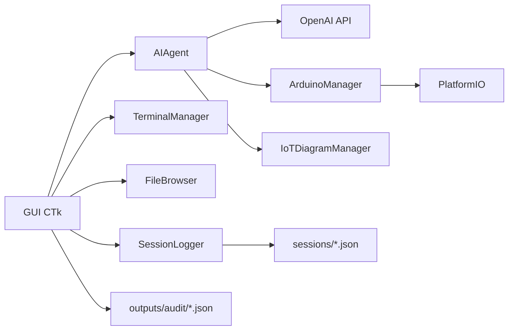

# Willy

Asistente de terminal con interfaz gráfica, orientado a prácticas de electrónica e IoT en laboratorio.

Willy combina:

1. Chat asistido por IA.
2. Ejecución de comandos en terminal.
3. Flujo técnico para microcontroladores con PlatformIO.
4. Capacidades de seguridad y auditoría para entornos educativos compartidos.

## 1. Visión del proyecto

El objetivo de Willy es reducir fricción en tareas frecuentes de laboratorio:

1. Diagnóstico de placas y puertos.
2. Compilación y carga de firmware.
3. Escaneo de buses I2C.
4. Generación de esquemáticos y BOM.
5. Trazabilidad de sesiones para docencia y soporte.

No es un chatbot genérico: está diseñado para operación guiada y controlada en contextos reales de prácticas técnicas.

## 2. Características principales

1. Interfaz de escritorio con paneles de chat, archivos, dashboard IoT y terminal.
2. Herramientas IA con llamadas a funciones para:
	1. Comandos de sistema.
	2. Lectura/escritura de archivos.
	3. Web search y fetch de contenido.
	4. Flujo IoT: detectar, build, upload, flash de sketch, scan I2C, esquemáticos.
3. Adaptación por sistema operativo en comandos comunes.
4. Modo plan para tareas multi-paso con confirmación.
5. Seguridad por perfiles y roles para laboratorios.
6. Auditoría exportable en JSON.

## 3. Arquitectura de alto nivel



Módulos relevantes:

1. app/gui.py: ventana principal y orquestación.
2. app/ai_agent.py: ciclo del agente, tool calling, políticas de seguridad y rol.
3. app/arduino_manager.py: integración PlatformIO y operaciones IoT.
4. app/session_logger.py: registro y exportación de auditoría.
5. app/file_browser.py: explorador de archivos integrado.
6. app/terminal_manager.py: ejecución de comandos y control de cwd.

## 4. Seguridad para laboratorio

Willy implementa un modelo de seguridad en capas.

### 4.1 Perfiles de seguridad

1. lab_safe (recomendado):
	1. Allowlist de comandos por sistema operativo.
	2. Bloqueo de patrones peligrosos.
2. standard:
	1. Más flexibilidad de comandos.
	2. Mantiene bloqueos críticos.
3. permissive:
	1. Sin restricciones de perfil.
	2. Solo para mantenimiento controlado.

### 4.2 Roles operativos

1. student:
	1. Herramientas acotadas.
	2. Bloquea ejecución arbitraria de comandos y escritura directa de archivos.
2. instructor:
	1. Flujo de laboratorio completo.
3. admin:
	1. Acceso total para soporte y mantenimiento.

### 4.3 Política forzada por estación

Si existe station_policy.json en la raíz, Willy aplica su sección enforced al iniciar y bloquea esos ajustes en la UI.

Ejemplo recomendado para equipos de alumnos:

```json
{
  "enforced": {
	 "security_profile": "lab_safe",
	 "operation_role": "student",
	 "require_command_confirmation": true,
	 "api_key_source": "env"
  }
}
```

### 4.4 Auditoría

Desde Configuración se pueden exportar reportes:

1. Últimos 7 días.
2. Sesión actual.

Salida en:

1. outputs/audit/

## 5. Requisitos

1. Python 3.11+ recomendado.
2. Dependencias Python en requirements.txt.
3. PlatformIO para flujos de build/upload IoT.
4. Clave OpenAI (recomendado por variable de entorno).

Dependencias actuales:

1. openai
2. customtkinter
3. Pillow
4. schemdraw
5. cairosvg
6. platformio

## 6. Instalación y ejecución

### 6.1 Clonar e instalar dependencias

Windows PowerShell:

```powershell
python -m venv .venv
Set-ExecutionPolicy -Scope Process -ExecutionPolicy RemoteSigned
.\.venv\Scripts\Activate.ps1
pip install -r requirements.txt
```

Linux/macOS:

```bash
python3 -m venv .venv
source .venv/bin/activate
pip install -r requirements.txt
```

### 6.2 API Key recomendada

Usar variable de entorno en lugar de guardar secretos en config.json.

Windows PowerShell (sesión actual):

```powershell
$env:OPENAI_API_KEY="tu_clave"
```

Linux/macOS (sesión actual):

```bash
export OPENAI_API_KEY="tu_clave"
```

### 6.3 Ejecutar Willy

Windows:

```powershell
python main.py
```

Windows comando directo:

```powershell
c:/DESARROLLO/willy-1/.venv/Scripts/python.exe main.py
```

Linux/macOS:

```bash
python3 main.py
```

## 7. Configuración

El archivo config.json define preferencias de ejecución. Claves comunes:

1. initial_directory
2. api_key_source
3. security_profile
4. operation_role
5. require_command_confirmation
6. model

Recomendación para entornos institucionales:

1. Evitar guardar openai_api_key en el repositorio.
2. Forzar api_key_source=env por política de estación.

## 8. Flujo de uso sugerido en laboratorio

1. Configurar estación:
	1. station_policy.json con perfil y rol.
	2. OPENAI_API_KEY por variable de entorno.
2. Iniciar Willy y verificar bloqueo de campos forzados.
3. Ejecutar práctica guiada:
	1. Detección de microcontrolador.
	2. Build y upload.
	3. Scan I2C si aplica.
4. Exportar auditoría al finalizar.

## 9. Testing

Ejecutar pruebas principales:

```powershell
python -m pytest tests/test_ai_agent.py tests/test_session_logger.py -q
```

## 10. Estructura del repositorio

```text
app/                    # Núcleo de la aplicación (GUI, agente, IoT, seguridad)
tests/                  # Pruebas unitarias
sessions/               # Registros de sesiones
outputs/                # Artefactos de salida (incluye auditoría y esquemáticos)
main.py                 # Entry point
requirements.txt        # Dependencias Python
AGENTS.md               # Guía de operación por roles/perfiles
```

## 11. Estado del desarrollo

Capacidades ya implementadas:

1. Endurecimiento por perfil de seguridad.
2. Roles operativos por herramienta.
3. Política forzada por estación.
4. Auditoría exportable.
5. Sanitización de logs y control de retención.

## 12. Roadmap sugerido

1. Firma/integridad de station_policy.json para evitar alteraciones locales.
2. Visor de auditoría dentro de la propia UI.
3. Plantillas de despliegue por tipo de laboratorio.
4. Integración opcional con servidor central de auditoría.

## 13. Licencia y contribución

Definir en esta sección el modelo de licencia y el proceso de contribución cuando se publique públicamente el repositorio.

Sugerencia mínima:

1. Añadir LICENSE.
2. Añadir CONTRIBUTING.md.
3. Añadir plantilla de issue y PR.